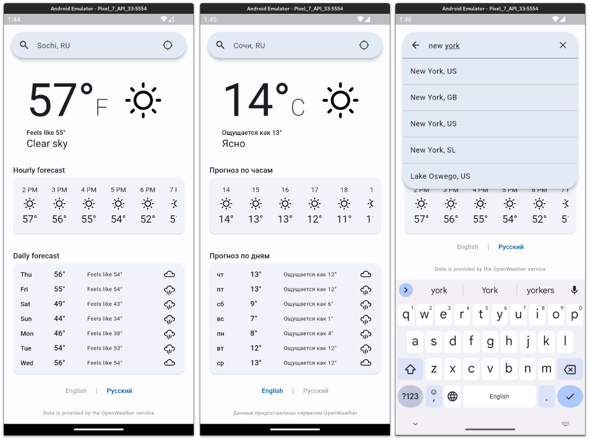

# Flutter Weather App

Стильный прогноз погоды в вашем телефоне

Используются данные сервиса [OpenWeather](https://openweathermap.org/api)

Функционал приложения:
- отображение текущей погоды
- прогноз на следующие 12 часов и 7 дней
- автоматическое определение текущего местоположения
- возможность выбрать произвольный город в поиске
- поддержка двух языков: английский (температура в Фаренгейтах) и русский (градусы Цельсия)
- локальное хранение языка приложения и выбранной локации

## Использованные инструменты
- Flutter
- BLoC
- GoRouter
- Retrofit
- Geolocator
- Shared preferences
- Internationalizing
- Подход Clean Architecture

## Скриншоты

## Запуск
Для запуска приложения необходимо предоставить в переменной окружения `api-key` ключ от сервиса [One Call API 3.0](https://openweathermap.org/api/one-call-3) 
